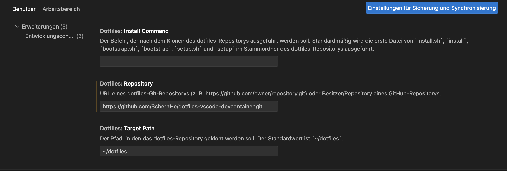

# dotfiles-vscode-devcontainer

Demo repository to store the dotfiles used for VSCode devcontainer. Currently, it is used to setup `zsh` with `oh-my-zsh` in the devcontainer.

## References

- <https://medium.com/@jamiekt/vscode-devcontainer-with-zsh-oh-my-zsh-and-agnoster-theme-8adf884ad9f6>
- <https://github.com/ohmyzsh/ohmyzsh>
- <https://github.com/deluan/zsh-in-docker>
- <https://code.visualstudio.com/docs/devcontainers/containers#_personalizing-with-dotfile-repositories>

## Settings in VSCode

## Notes

- The `dotfiles` repository gets cloned into the `$HOME` folder
- By default, VSCode will execute the `install.sh` script
